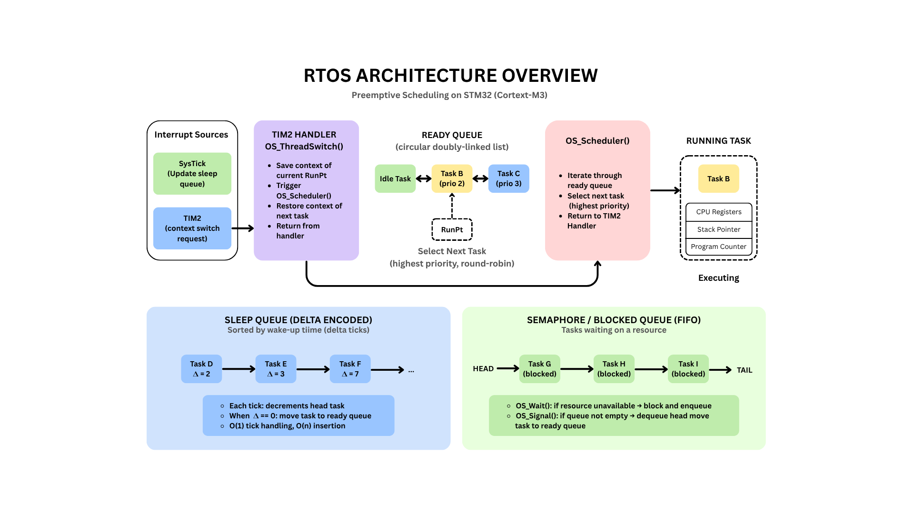
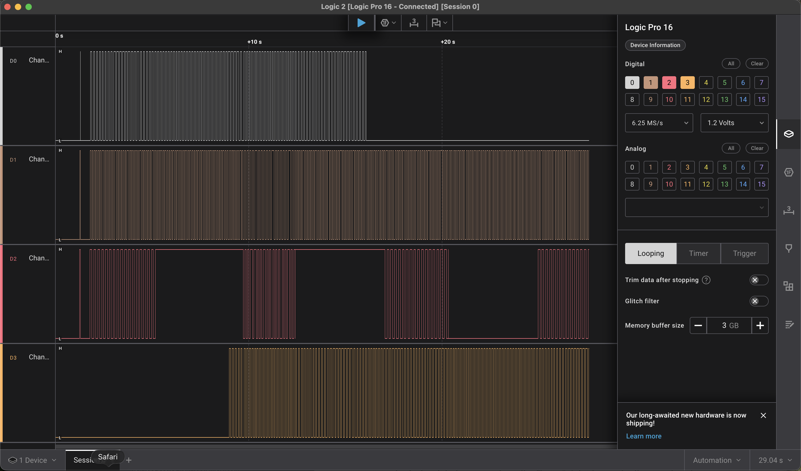

# Real-Time Operating System for STM32F103

This project is a preemptive real-time operating system written for the STM32F103 Cortex-M3 microcontroller. The goal of this project was to better understand how RTOS kernels operate at a low level, including scheduling, context switching, synchronization, and timing management on ARM Cortex-M hardware.

The implementation was heavily inspired by the book *Real-Time Operating Systems for ARM® Cortex™-M Microcontrollers* by Jonathan W. Valvano. While the book primarily targets Texas Instruments MSP432 and TM4C microcontrollers, this project adapts many of the same operating system concepts to the STM32F103 platform.

This RTOS was built primarily as a learning project to explore embedded systems design, ARM exception handling, and low-level kernel architecture without relying on existing frameworks such as FreeRTOS or Zephyr.

## Features

- Preemptive priority-based scheduler
- Round-robin scheduling among equal-priority tasks
- Context switching implemented in ARM assembly
- Circular doubly-linked ready queue
- Delta-encoded sleep queue
- FIFO semaphore blocked queues
- Critical sections using PRIMASK interrupt masking
- Idle task using ARM WFI low-power instruction
- Timer-driven thread switching
- Thread stack initialization compatible with Cortex-M exception return behavior

## What is a Real-Time Operating System

A real-time operating system (RTOS) is responsible for managing task scheduling, synchronization, timing, and hardware resources while meeting deterministic timing requirements.

Unlike general-purpose operating systems such as Windows, macOS, or Linux, RTOS kernels prioritize predictable execution and bounded latency over throughput and user interactivity. Real-time operating systems are commonly used in embedded systems where timing guarantees are critical, including robotics, automotive systems, medical devices, industrial control systems, and microcontroller-based applications.

The primary goal of this RTOS was to provide a lightweight threading and synchronization environment for embedded applications running on STM32 hardware while exposing the low-level mechanics behind operating system design.

## Architecture

### Scheduler
The scheduler uses a preemptive priority-based design with round-robin behavior among equal-priority tasks. Scheduling decisions occur periodically from a timer interrupt.

### Context Switching
Context switching is implemented in ARM assembly. The kernel manually saves and restores registers not automatically preserved during exception entry.

### Ready Queue
Runnable threads are stored in a circular doubly-linked list, allowing efficient insertion and removal during scheduling operations.

### Sleep Queue
Sleeping threads are managed using a delta-encoded linked list. Only the head node is decremented each timer tick, reducing per-tick overhead to O(1).

### Synchronization
Counting semaphores are implemented using FIFO blocked queues. Threads waiting on unavailable resources are removed from the ready queue until signaled.

### Critical Sections
Critical kernel operations are protected using PRIMASK interrupt masking to prevent race conditions during shared data structure updates.

## Demonstration

The image below shows multiple RTOS tasks executing concurrently with periodic sleeping and scheduling behavior verified using a logic analyzer.

